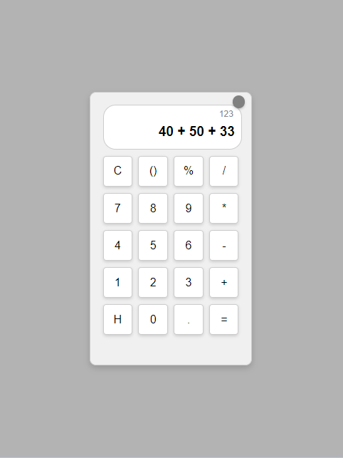

---

# SVELTE CALCULATOR WITH LIVE ANSWER & DARK MODE  

A modern, responsive calculator built using **Svelte**, featuring a **live answer preview**, **toggleable dark mode**, and a **minimalist, user-friendly design**.  

## Features  

✅ Basic arithmetic operations (+, -, ×, ÷)  
✅ **Live answer preview** (Displays result in real-time)  
✅ **Smart parentheses handling** (Automatically adds `(` or `)`)  
✅ **Calculation history** (View the last 5 calculations)  
✅ **Responsive UI** with a clean, modern layout  
✅ **Smooth animated dark 7 RGB modeS transition**  
✅ **Minimalist theme mode toggle button**  

## Installation & Usage  

1. Clone my repository:  
   ```bash
   git clone https://github.com/Vivek-k001/Modern-Calculator.git
   ```  
2. Install dependencies:  
   ```bash
   npm install
   ```  
3. Run the app:  
   ```bash
   npm run dev
   ```  

## Tech Stack  

- **Svelte** – Frontend framework  
- **CSS** – For styling and animations  

## Preview of the Calculator  

*Light Mode*  
  

*Dark Mode*  
  

*RGB Mode*  
 

*Live Answer Feature*  
  

*Calculation History Feature*  
  


---